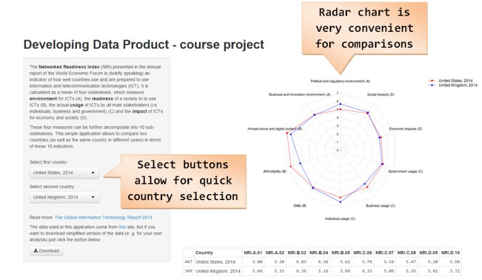

---
title       : NRI Explorer
subtitle    : Developing Data Products Course Project (January 2015)
author      : 
job         : 
framework   : io2012        # {io2012, html5slides, shower, dzslides, ...}
highlighter : highlight.js  # {highlight.js, prettify, highlight}
hitheme     : tomorrow      # 
widgets     : []            # {mathjax, quiz, bootstrap}
mode        : selfcontained # {standalone, draft}
knit        : slidify::knit2slides
--- 

## Motivation

* Each year World Economic Forum publishes [report](http://www.weforum.org/reports/global-information-technology-report-2014) which presents [NRI](http://en.wikipedia.org/wiki/Networked_Readiness_Index) index for about 150 countries
* Information card about specific country looks like this:


* The aim of the presented application was to provide the possibility of comparing countries in terms of 10 main indicators which formulate the NRi index

--- 

## Application description

* Basic assumption: simple - just choose countries and watch data changing
* Data presented in radar chart




--- 

## File Global.R

* Its role is to prepare the original data obtained from [this](http://www.weforum.org/global-information-technology-report-2014-data-platform) site, which are in the long format (i.e. few columns):

```{r echo=FALSE}
nriData <- read.table("../data/GITR_2014_data_platform.csv", header=TRUE, sep="\t",
                      dec = ",", stringsAsFactors=FALSE, fill = TRUE, quote = "\"")
names(nriData)[1] <- "Edition"
```

```{r echo=FALSE}
str(nriData)
```

(the aim was to be absolutely transparent about all data transformation performed for the assignment)

--- 

## Files ui.R and server.R

* ui.R is responsible for application interface - it mainly allows a user to choose countries, but it also presents information about application
* server.R reacts on user's action - it selects data for chosen countries, combines them into one dataframe and then creates plot and table to be displayed


Oh, and [one more thing](https://www.youtube.com/watch?v=hyCzbXx9i-M) ;) The user is allowed to download data in a simplified form.
